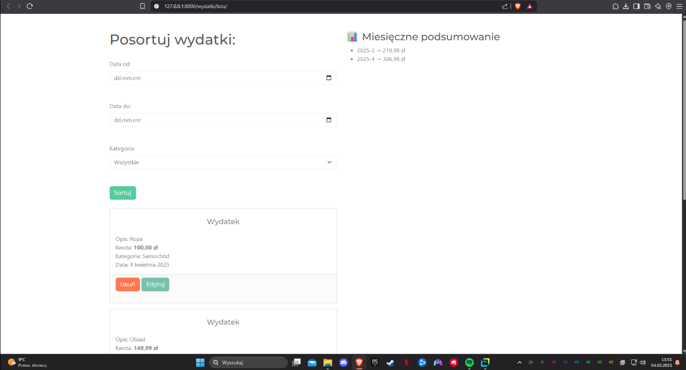
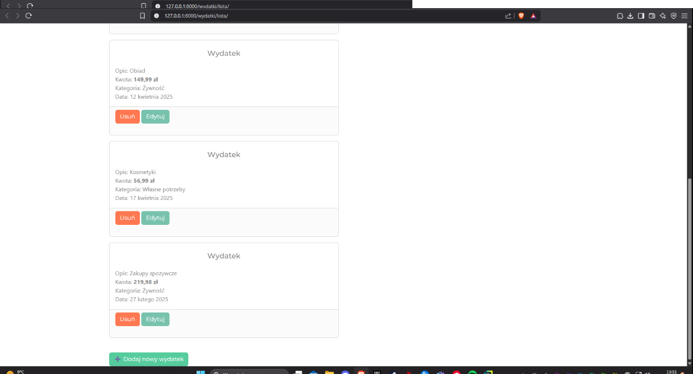

### 💸 [Django Budget App](./Budzet)

# 💸 Budżet Domowy – Aplikacja Django (PL)

Aplikacja webowa w Django, która umożliwia zarządzanie budżetem domowym: dodawanie wydatków, filtrowanie po kategoriach i dacie oraz przeglądanie miesięcznych podsumowań. Cała logika aplikacji znajduje się w aplikacji `wydatki`, w której zastosowałem podejście funkcyjne (FBV).

Używam klasycznych widoków Django, formularzy `POST/GET`, filtrowania danych po polach modelu (`filter()`) i agregowania danych za pomocą `annotate()` oraz `Sum()` z `django.db.models`. Dane są renderowane w szablonach `lista.html` i inne. Obsługiwane są dynamiczne filtry URL (GET) oraz walidacje POST przy dodawaniu danych.

W szablonach zastosowałem pętle, filtrowanie i podstawowe style CSS. Cały projekt korzysta z ORM Django oraz lokalnej bazy SQLite.

---

## 🔍 Funkcje

✅ Dodawanie nowych wydatków (opis, kwota, kategoria, data)  
✅ Edytowanie i usuwanie istniejących transakcji  
✅ Filtrowanie po:
- dacie od / do  
- kategorii wydatków

✅ Miesięczne podsumowanie wydatków z dynamicznym zestawieniem  
✅ Intuicyjny i responsywny frontend oparty o HTML + CSS  
✅ Zabezpieczenie danych przez Django ORM (SQLite)  
✅ Walidacja formularzy i komunikaty `messages`  
✅ Obsługa zapytań GET i POST

---

## 📷 Zrzuty ekranu

| Filtrowanie i podsumowanie | Lista wydatków |
|----------------------------|----------------|
|  |  |

---

## 🛠️ Technologie

- Python 3.11+
- Django 4.x
- SQLite 3
- HTML + CSS (custom)

---

## 🚀 Jak uruchomić lokalnie?

```bash
git clone https://github.com/michu1810/Portfolio.git
cd Portfolio/django-budget/Budzet
python manage.py runserver
```

Zainstaluj zależności:

```bash
pip install django
```

---

## 📁 Struktura projektu

<pre> 
  Budzet/ 
  ├── manage.py 
  ├── db.sqlite3 
  ├── Budzet/ ← konfiguracja Django (settings, urls) 
  └── wydatki/ ← główna aplikacja: modele, widoki, szablony 
</pre>

---

## ✍️ Autor

Michał Jamros  
GitHub: [https://github.com/michu1810](https://github.com/michu1810)

---

# 💸 Budget Tracker – Django Web Application (EN)

A Django-based web application for managing and tracking personal expenses. Users can add, edit, and filter expenses by date and category. The clean and intuitive UI makes it easy to monitor monthly summaries and expense history.

The logic is implemented using classic function-based views (FBV). The app handles GET/POST form data, filtering with `filter()`, and aggregation via `annotate()` and `Sum()` from `django.db.models`. Views return data to HTML templates using Django context, and validation/messages are shown via `django.contrib.messages`.

---

## 🔍 Features

✅ Add new expenses (description, amount, category, date)  
✅ Edit and delete existing transactions  
✅ Filter by:
- date range  
- expense category

✅ Monthly spending summary with total amount  
✅ Responsive and clean interface (HTML + CSS)  
✅ Data stored in SQLite using Django ORM  
✅ Form validation with `messages`  
✅ Uses GET and POST request logic

---

## 📷 Screenshots

| Filter and Summary | Expense List |
|--------------------|--------------|
|  |  |

---

## 🛠️ Technologies

- Python 3.11+
- Django 4.x
- SQLite 3
- HTML + CSS (custom)

---

## 🚀 How to Run Locally

```bash
git clone https://github.com/michu1810/Portfolio.git
cd Portfolio/django-budget/Budzet
python manage.py runserver
```

Make sure Django is installed:

```bash
pip install django
```

---

## 📁 Project Structure

<pre> 
  Budzet/ 
  ├── manage.py 
  ├── db.sqlite3 
  ├── Budzet/ ← Django settings and configuration 
  └── wydatki/ ← main app: models, views, templates
</pre>

---

## ✍️ Author

Michał Jamros  
GitHub: [https://github.com/michu1810](https://github.com/michu1810)


